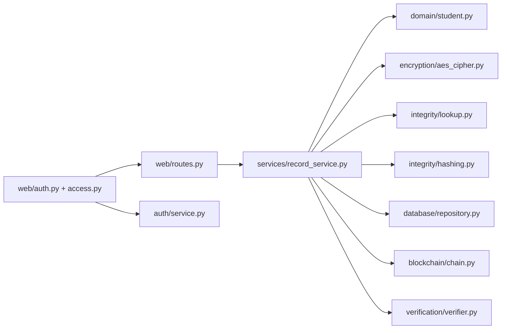

# Kế hoạch viết mã và liên kết nội dung

## Cách hợp nhất hai phần công việc

Không chia dự án theo người thực hiện. Mọi chức năng đi qua một lớp điều phối chung là `RecordService`. Nhờ vậy, phần mật mã và phần quản lý dữ liệu luôn được gọi trong cùng một luồng và cùng một giao dịch SQLite.

`routes.py` không được tự mã hóa, tự viết câu lệnh SQLite hoặc tự tính băm. Tệp này chỉ nhận dữ liệu biểu mẫu, gọi dịch vụ và hiển thị kết quả.

Sơ đồ thành phần, giao dịch, xác minh và lược đồ dữ liệu đầy đủ nằm tại [kiến trúc hệ thống hiện thực](KIEN_TRUC_HE_THONG.md).

## Trách nhiệm cụ thể của từng phần mã nguồn

| Phần | Tệp chính | Nội dung cần chịu trách nhiệm |
|---|---|---|
| Cấu hình | `src/config.py` | Đọc `.env`, kiểm tra khóa AES, đường dẫn SQLite, phiên và cơ chế khóa đăng nhập |
| Xác thực | `src/auth/service.py` | Quản lý tài khoản, băm mật khẩu bằng `scrypt`, khóa tạm, đổi vai trò/mật khẩu/trạng thái |
| Mô hình hồ sơ | `src/domain/student.py` | Chuẩn hóa mã sinh viên, họ tên, ngày sinh, chương trình, học phần và điểm |
| Tuần tự hóa | `src/encryption/serialization.py` | Chuyển dữ liệu sang JSON chuẩn hóa và tạo dữ liệu xác thực bổ sung |
| Mã hóa | `src/encryption/aes_cipher.py` | Thực hiện AES-GCM, nonce 12 byte, giải mã và phát hiện sai thẻ xác thực |
| Chỉ mục kín | `src/integrity/lookup.py` | Dẫn xuất khóa tra cứu và tạo HMAC-SHA-256 từ mã sinh viên |
| Băm phong bì | `src/integrity/hashing.py` | Tính SHA-256 cho phong bì mã hóa bằng tuần tự hóa ổn định |
| Kết nối dữ liệu | `src/database/connection.py` | Mở SQLite, bật khóa ngoại và điều khiển giao dịch |
| Lược đồ | `src/database/schema.py` | Tạo `users`, `records`, `record_versions`, `audit_blocks` và nâng cấp lược đồ v1-v3 |
| Truy cập dữ liệu | `src/database/repository.py` | Thực hiện câu lệnh thêm, đọc và cập nhật, không chứa quyết định nghiệp vụ |
| Cấu trúc khối | `src/blockchain/block.py` | Lưu dữ liệu một khối và cách tính `block_hash` |
| Chuỗi khối | `src/blockchain/chain.py` | Tạo khối đầu tiên, nối khối, kiểm tra chiều cao và liên kết |
| Xác minh | `src/verification/verifier.py` | Kiểm tra chuỗi, SHA-256 phong bì, HMAC tra cứu và xác thực AES-GCM |
| Điều phối | `src/services/record_service.py` | Thêm, sửa, xóa, đọc, tìm kiếm và xác minh trong một luồng thống nhất |
| Ứng dụng Flask | `src/web/app.py` | Tạo ứng dụng, khởi tạo dịch vụ, cấu hình phiên và xử lý lỗi |
| Truy cập web | `src/web/auth.py`, `src/web/access.py` | Đăng nhập, đăng xuất, nạp người dùng và kiểm tra RBAC |
| Địa chỉ giao diện | `src/web/routes.py` | Nhận biểu mẫu, gọi dịch vụ, chuyển kết quả sang trang HTML |
| Trang hiển thị | `src/web/templates/` | Hiển thị bảng điều khiển, hồ sơ, khối và xác minh |
| Kiểu trình bày | `src/web/static/` | Cung cấp giao diện và thao tác thêm hàng học phần |
| Dữ liệu mô phỏng | `experiments/generate_dataset.py` | Sinh tập 100, 1.000 và 10.000 hồ sơ có thể tái lập |
| Đo thực nghiệm | `experiments/run_experiment.py` | Đo ba cấu hình và giữ kết quả thô |
| Biểu đồ | `experiments/make_figures.py` | Tạo hình từ kết quả thống kê, không nhập số liệu bằng tay |
| Kiểm thử | `tests/` | Chứng minh từng lớp và toàn bộ luồng hoạt động đúng |

## Luồng thêm hồ sơ

1. `auth.py` xác thực phiên; `access.py` yêu cầu vai trò `admin` hoặc `registrar`.
2. `routes.py` nhận các trường từ biểu mẫu và lấy `actor_id`/`role` hiện tại.
3. `student.py` chuẩn hóa và từ chối dữ liệu sai.
4. Dịch vụ tạo UUID nội bộ và HMAC từ mã sinh viên.
5. `aes_cipher.py` mã hóa JSON bằng AES-GCM; AAD gắn hồ sơ, phiên bản, thao tác và chủ thể thực hiện.
6. `hashing.py` băm đầy đủ ngữ cảnh, chủ thể thực hiện, nonce và bản mã.
7. `repository.py` ghi phiên bản mã hóa cùng chủ thể thực hiện.
8. `chain.py` nối một khối `CREATE` có thông tin chủ thể vào đầu chuỗi hiện tại.
9. Cả bản ghi và khối được xác nhận trong cùng một giao dịch.

Nếu bước ghi phiên bản hoặc nối khối thất bại, toàn bộ thao tác phải được hoàn tác.

## Luồng cập nhật hồ sơ

1. Đọc và giải mã phiên bản hiện tại.
2. So sánh `expected_version` để ngăn ghi đè thay đổi mới hơn.
3. Chuẩn hóa nội dung mới và kiểm tra mã sinh viên không trùng.
4. Tạo nonce mới và phiên bản tăng thêm một.
5. Ghi phong bì mã hóa mới, giữ nguyên phiên bản cũ.
6. Nối khối `UPDATE` và cập nhật con trỏ phiên bản hiện tại.

## Luồng xóa hồ sơ

1. Đọc bản chụp hiện tại.
2. Mã hóa lại bản chụp bằng nonce mới với thao tác `DELETE`.
3. Tạo phiên bản tiếp theo và khối `DELETE`.
4. Chuyển trạng thái bản ghi thành `deleted`.

Không xóa vật lý phiên bản cũ vì lịch sử sẽ không còn kiểm chứng được.

## Luồng xác minh

Xác minh toàn hệ thống gồm ba lớp:

1. Tính lại `block_hash` và kiểm tra `previous_hash` của từng khối.
2. Tính lại SHA-256 của từng phong bì mã hóa và so sánh với khối tương ứng.
3. Giải mã AES-GCM để kiểm tra thẻ xác thực và dữ liệu JSON.

Kết quả phải nêu lỗi cụ thể thay vì chỉ trả về đúng hoặc sai.

## Kế hoạch sáu tuần gắn với mã nguồn

### Tuần 1, từ 19/06 đến 26/06

* Tạo cấu trúc dự án, môi trường ảo, `.gitignore`, tệp thư viện và ứng dụng Flask tối thiểu
* Viết mục mở đầu và tập hợp nguồn tham khảo
* Đầu ra là kho mã chạy được và câu hỏi nghiên cứu rõ ràng

### Tuần 2, từ 27/06 đến 04/07

* Viết mã cho `domain`, `database/schema.py`, `database/repository.py` và cấu trúc `Block`
* Vẽ kiến trúc, luồng dữ liệu và lược đồ SQLite
* Viết phần hệ thống đề xuất và bản nháp mô hình mật mã

### Tuần 3, từ 05/07 đến 12/07

* Viết mã AES-GCM, JSON chuẩn hóa, HMAC, SHA-256, nối khối và xác minh
* Viết kiểm thử Unicode, nonce, thẻ xác thực và liên kết khối
* Hoàn thiện mô hình mật mã và môi trường cài đặt

### Tuần 4, từ 13/07 đến 20/07

* Viết mã `RecordService` và đặt toàn bộ thao tác trong giao dịch nguyên tử
* Nối giao diện quản lý hồ sơ, trang khối và trang xác minh
* Chạy kiểm thử tích hợp và chụp ảnh giao diện
* Hoàn thiện phần cài đặt trong báo cáo

### Tuần 5, từ 21/07 đến 28/07

* Sinh dữ liệu 100, 1.000 và 10.000 hồ sơ
* Chạy ba cấu hình với 30 lần lặp
* Thử thay đổi trái phép và tạo biểu đồ
* Viết thiết lập thực nghiệm, kết quả và thảo luận từ số liệu thật

### Tuần 6, từ 29/07 đến 04/08

* Hoàn thiện giới hạn, hướng phát triển, kết luận và tóm tắt
* Đưa nội dung vào mẫu FAIR 2026
* Rà soát trích dẫn, hình, bảng, công thức và kiểm thử lại trên môi trường sạch

## Thứ tự nên mở tệp trong Visual Studio Code

1. Đọc `src/auth/service.py` và `src/web/access.py` để hiểu xác thực/RBAC.
2. Đọc `src/domain/student.py` để hiểu dữ liệu hợp lệ.
3. Đọc `src/encryption/aes_cipher.py`, `src/integrity/lookup.py` và `src/integrity/hashing.py` để hiểu lớp bảo vệ.
4. Đọc `src/database/schema.py` để hiểu dữ liệu thực tế được lưu.
5. Đọc `src/blockchain/block.py` để hiểu cách một khối và actor được băm.
6. Đọc `src/services/record_service.py` để thấy mọi phần được nối với nhau.
7. Đọc `src/web/routes.py` để thấy giao diện gọi nghiệp vụ.
8. Đọc `tests/` để biết mỗi yêu cầu được chứng minh ra sao.
9. Đọc `experiments/run_experiment.py` trước khi thu số liệu báo cáo.

## Tiêu chí hoàn thành trước khi đo

* Mã hóa và giải mã đúng tiếng Việt
* Hai lần mã hóa cùng dữ liệu có nonce khác nhau
* Sai nonce, bản mã, thẻ hoặc dữ liệu xác thực bổ sung đều thất bại
* SQLite không chứa mã sinh viên hoặc họ tên dạng rõ
* Thêm hồ sơ tạo phiên bản 1 và khối `CREATE`
* Cập nhật tạo phiên bản mới và khối `UPDATE`
* Xóa logic tạo khối `DELETE`
* Sửa hoặc xóa một khối làm xác minh thất bại
* Khởi động lại ứng dụng không làm mất chuỗi
* Toàn bộ kiểm thử tự động thành công
* Người chưa đăng nhập bị chuyển về trang đăng nhập
* Vai trò `auditor` đọc/xác minh được nhưng không tạo, sửa hoặc xóa hồ sơ
* Thao tác web ghi đúng `actor_id`/`role` và việc sửa thông tin chủ thể làm xác minh thất bại
* Lược đồ cơ sở dữ liệu v1 được nâng cấp mà dữ liệu cũ vẫn xác minh được
