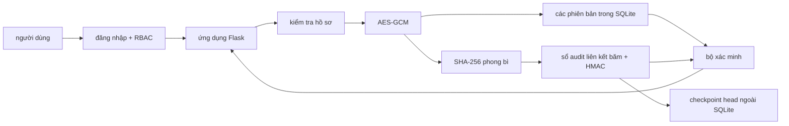

# dự thảo nội dung báo cáo

## trạng thái tài liệu

Tệp này đang được sửa sau phản biện FAIR 2026. Phiên bản mã nguồn mới có HMAC cho từng block, checkpoint head ngoài SQLite, 116 kiểm thử tự động và độ bao phủ 90,81%. Các số liệu hiệu năng ngày 12/07/2026 thuộc thiết kế cũ và chỉ được giữ làm dấu vết; không dùng làm kết quả của bản REV-ECIT trước khi chạy lại.

Bộ số liệu 30 lần lặp được tạo trước đợt bổ sung đăng nhập/RBAC và actor schema v2 ngày 20/07/2026. Chức năng mới đã qua kiểm thử và chạy benchmark nhanh, nhưng phải chạy lại bộ 30 lần lặp trước khi dùng số hiệu năng như kết quả cuối của phiên bản hiện tại.

Không đưa tệp này vào mẫu FAIR 2026 trước khi nhận lại mẫu báo cáo và kiểm tra quy định định dạng.

## tiêu đề đề xuất

SecureEdu Hồ sơ sinh viên phiên bản với mã hóa xác thực và nhật ký kiểm toán có khóa

## tóm tắt

Nghiên cứu xây dựng SecureEdu, một hệ thống một nút cho hồ sơ sinh viên có phiên bản. Nội dung được bảo vệ bằng AES-256-GCM; mã tra cứu dùng HMAC với khóa tách miền; mỗi audit block chứa SHA-256 của phong bì mã hóa và được xác thực bằng HMAC từ một khóa audit dẫn xuất riêng. Head mới nhất được checkpoint ngoài SQLite để bộ xác minh phát hiện cả việc sửa rồi rehash lẫn rollback hoặc cắt lịch sử trong mô hình DB writer không có khóa và không sửa được checkpoint. Đánh giá sửa đổi phân biệt mutation không nhất quán với kẻ tấn công thích nghi có thể sửa mọi bảng và tính lại hash công khai. Trong 390 lần thử trên 13 kịch bản, bộ xác minh từ chối cả 180 mutation không nhất quán và 210 tấn công DB writer thích nghi; đây là kiểm thử quyết định trên các kịch bản đã định nghĩa, không phải xác suất phát hiện mọi tấn công. Kết quả hiệu năng và baseline của thiết kế mới vẫn phải được chạy lại trước khi nộp REV-ECIT.

## từ khóa

hồ sơ sinh viên, AES-GCM, authenticated logging, HMAC, rollback detection

## I. mở đầu

Hồ sơ sinh viên chứa thông tin định danh, chương trình học và kết quả học tập. Việc chỉ giới hạn quyền truy cập cơ sở dữ liệu chưa đủ để phát hiện dữ liệu đã bị thay đổi ngoài quy trình của ứng dụng. Đề tài này khảo sát cách kết hợp mã hóa xác thực với một sổ nhật ký liên kết băm nhằm bảo vệ nội dung lưu trữ và tạo dấu vết kiểm toán cho từng phiên bản hồ sơ.

Hệ thống đề xuất chuẩn hóa hồ sơ thành JSON, mã hóa nội dung bằng AES-GCM với khóa 256 bit và lưu bản mã trong SQLite. Mỗi thao tác tạo một khối chứa giá trị băm của phiên bản và khối trước; khối còn có HMAC bí mật, trong khi head mới nhất được giữ ở checkpoint ngoài SQLite. Sự kết hợp này nhằm chặn phản ví dụ mà hash chain công khai không giải quyết được: DB writer sửa dữ liệu rồi tính lại toàn bộ chuỗi.

Các đóng góp dự kiến gồm:

1. một thiết kế kết hợp phiên bản mã hóa, block HMAC và checkpoint ngoài SQLite với giả định tin cậy được phát biểu rõ
2. quy trình fail-closed kiểm tra checkpoint trước khi ghi và kiểm tra cả block HMAC, chain, quan hệ version-block và AES-GCM khi xác minh
3. bộ tấn công thích nghi tái lập gồm modify-and-rehash, delete-and-rechain, truncation, splicing, reorder/reindex, sửa timestamp và rollback từng hồ sơ
4. đánh giá chi phí biên của từng lớp và so sánh với baseline độc lập sẽ được xác định trong bản thực nghiệm mới

Các phát biểu trên cần được nối với tài liệu tham khảo phù hợp sau khi nhận lại danh mục nguồn gốc.

## II. nghiên cứu liên quan

Chia nội dung thành năm nhóm:

1. quản lý và bảo vệ hồ sơ giáo dục
2. mã hóa xác thực cho dữ liệu lưu trữ
3. authenticated database và encrypted database như SQLCipher/TDE
4. forward-secure hoặc keyed audit logging, gồm Crosby-Wallach và SealFSv2
5. Merkle transparency log và append-only verification như Certificate Transparency/Trillian

### bảng so sánh cần hoàn thiện

| nghiên cứu | dữ liệu được mã hóa | cơ chế toàn vẹn | lưu lịch sử | thực nghiệm hiệu năng | giới hạn |
|---|---:|---:|---:|---:|---|
| nguồn 1 | chờ đối chiếu | chờ đối chiếu | chờ đối chiếu | chờ đối chiếu | chờ đối chiếu |
| nguồn 2 | chờ đối chiếu | chờ đối chiếu | chờ đối chiếu | chờ đối chiếu | chờ đối chiếu |

Không điền tên bài, năm hoặc kết luận từ trí nhớ. Mọi hàng phải được kiểm tra từ tài liệu gốc.

## III. hệ thống đề xuất

### kiến trúc



Hệ thống chạy trên một máy và có một đầu ghi. Vì vậy, thành phần kiểm toán được mô tả là sổ nhật ký riêng tư liên kết băm, không được coi là một mạng chuỗi khối phân tán có đồng thuận nhiều nút.

### dữ liệu lưu trữ

Bốn bảng chính là:

* `users` lưu username, password hash `scrypt`, vai trò và trạng thái đăng nhập/khóa
* `records` lưu UUID nội bộ, chỉ mục HMAC, phiên bản hiện tại, trạng thái và thời gian
* `record_versions` lưu thuật toán, mã khóa, nonce, bản mã có thẻ xác thực, giá trị băm, thao tác và actor
* `audit_blocks` lưu chiều cao, thời gian, liên kết khối, UUID, phiên bản, thao tác, actor, các giá trị băm và `block_mac`
* checkpoint ngoài SQLite lưu head mới nhất và HMAC của checkpoint

Họ tên, mã sinh viên, ngày sinh, chương trình, học phần và điểm không được lưu dạng rõ.

### mô hình đe dọa

Đề tài xét kẻ tấn công `A_DB` có thể đọc và thay đổi tùy ý mọi bảng, chỉ mục, thứ tự hàng và metadata trong SQLite; kẻ tấn công biết thuật toán, có thể tính lại SHA-256 và sửa nhất quán mọi trạng thái phụ thuộc. `A_DB` không có khóa gốc/khóa audit và không có quyền sửa hoặc rollback checkpoint ngoài SQLite. Đây là ranh giới tin cậy bắt buộc, không phải thuộc tính tự có của file checkpoint.

Mô hình không bao phủ kẻ chiếm đồng thời SQLite, khóa gốc và checkpoint; kẻ đó có thể tạo lại block HMAC và checkpoint hợp lệ. Hệ thống cũng không tuyên bố forward security khi khóa audit hiện tại bị lộ. Checkpoint phải nằm trên miền lưu trữ tách quyền ghi DB, tốt hơn là KMS-backed store, WORM hoặc dịch vụ transparency độc lập.

### giao dịch nguyên tử

Khi tạo một phiên bản, hệ thống kiểm tra checkpoint hiện tại rồi dùng `BEGIN IMMEDIATE`. Việc ghi phiên bản, cập nhật con trỏ hồ sơ và nối khối nằm trong cùng một giao dịch SQLite. Sau khi commit, checkpoint được thay thế nguyên tử và `fsync`. SQLite và checkpoint vẫn không thuộc một giao dịch nguyên tử xuyên hai tài nguyên; sự cố giữa hai bước làm xác minh fail-closed và cần quy trình khôi phục có kiểm soát.

## IV. mô hình mật mã

### chuẩn hóa hồ sơ

Gọi hồ sơ chuẩn hóa là `R`. Dữ liệu rõ đưa vào mã hóa là:

```text
P = JSON_chuẩn(R)
```

JSON sử dụng UTF-8, sắp xếp khóa, không có khoảng trắng không cần thiết và từ chối giá trị không hữu hạn.

### mã hóa xác thực

Với mỗi phiên bản, hệ thống tạo nonce ngẫu nhiên 12 byte mới. Dữ liệu xác thực bổ sung liên kết bản mã với ngữ cảnh:

```text
A = JSON_chuẩn(record_id, version, operation, schema_version, actor_id, actor_role)
C = AES-GCM-Encrypt(K, nonce, P, A)
```

`C` gồm bản mã và thẻ xác thực 16 byte do thư viện `cryptography` trả về. Khóa `K` dài 32 byte và được đọc từ `.env`.

### giá trị băm phiên bản

Phong bì được băm gồm UUID, phiên bản, thao tác, actor, phiên bản cấu trúc, tên thuật toán, mã khóa, nonce và bản mã:

```text
H_record = SHA-256(domain_record || JSON_chuẩn(phong_bì))
```

Tiền tố miền tách mục đích băm phong bì khỏi mục đích băm khối.

### giá trị băm khối

Khối thứ `i` chứa chiều cao, thời gian, UUID, phiên bản, thao tác, actor, `H_record` và giá trị băm của khối trước:

```text
H_i = SHA-256(domain_block || JSON_chuẩn(block_i))
```

Khối đầu tiên có thời gian và dữ liệu cố định. Các khối sau phải có `previous_hash = H_(i-1)`.

### xác thực block và checkpoint

Khóa audit được dẫn xuất từ khóa gốc bằng HKDF-SHA-256 với `info` riêng, tách khỏi khóa AES và khóa tra cứu:

```text
K_audit = HKDF-SHA-256(K_root, salt, info_audit)
M_i = HMAC-SHA-256(K_audit, domain_mac || i || H_i)
A_head = HMAC-SHA-256(K_audit, domain_anchor || checkpoint)
```

`M_i` ngăn DB writer tính MAC mới sau khi sửa và rehash. Checkpoint chứa `(index, H_i, M_i)` của head; `A_head` xác thực checkpoint và phép so sánh chính xác với head phát hiện rollback/cắt suffix.

### chỉ mục tìm kiếm

Khóa HMAC được dẫn xuất từ khóa AES bằng HKDF-SHA256 với chuỗi phân tách miền. Mã sinh viên chuẩn hóa được ánh xạ thành:

```text
lookup_token = HMAC-SHA-256(K_lookup, domain_lookup || student_code)
```

Cách này che mã sinh viên khỏi người chỉ đọc SQLite. Nó vẫn làm lộ việc hai giá trị tra cứu giống nhau và chưa hỗ trợ luân chuyển khóa độc lập trong phiên bản hiện tại.

## V. cài đặt

Ứng dụng dùng Python, Flask, SQLite và thư viện `cryptography`. Lớp `RecordService` là điểm điều phối duy nhất cho các thao tác hồ sơ. Giao diện không chứa câu lệnh SQLite hoặc thuật toán mật mã.

| nhóm mã | trách nhiệm |
|---|---|
| `src/domain` | chuẩn hóa và kiểm tra hồ sơ |
| `src/encryption` | JSON xác định, AAD và AES-GCM |
| `src/integrity` | HKDF, HMAC tra cứu, HMAC audit, checkpoint và SHA-256 |
| `src/database` | lược đồ, kết nối và truy cập dữ liệu |
| `src/blockchain` | cấu trúc và phép băm khối |
| `src/verification` | xác minh ba lớp |
| `src/services` | giao dịch nghiệp vụ thống nhất |
| `src/web` | giao diện quản lý và xác minh |

Giao diện được thiết kế theo hướng dashboard bảo mật doanh nghiệp với tên **SecureEdu Audit Ledger**, sử dụng cùng hệ thống màu, icon SVG và trạng thái trên các trang đăng nhập, tổng quan, hồ sơ, nhật ký audit và xác minh. Ảnh chụp thực tế ở kích thước desktop và mobile được lưu trong `docs/screenshots/`.

### Kết quả kiểm thử kỹ thuật

| chỉ tiêu | kết quả ngày 27/09/2026 |
|---|---|
| kiểm thử tự động | 116/116 đạt |
| độ bao phủ mã nguồn | 90,81% tổng thể |
| ngưỡng coverage bắt buộc | tối thiểu 90% |
| kiểm tra phụ thuộc | không có phụ thuộc hỏng |
| kiểm tra giao diện Chrome | đạt ở 375 px và 1440 px; không tràn ngang |
| accessibility chính | skip link, focus-visible, label biểu mẫu, reduced-motion, icon SVG |

## VI. thiết lập thực nghiệm

### môi trường

| thuộc tính | giá trị |
|---|---|
| bộ xử lý | cần xác nhận từ máy đã chạy bộ số liệu ngày 12/07/2026 |
| bộ nhớ | cần xác nhận từ máy đã chạy bộ số liệu ngày 12/07/2026 |
| hệ điều hành | cần xác nhận từ máy đã chạy bộ số liệu ngày 12/07/2026 |
| Python | 3.12 theo `requirements-lock.txt`; cần đối chiếu phiên bản vá |
| Flask | 3.1.3 theo `requirements-lock.txt` |
| cryptography | 49.0.0 theo `requirements-lock.txt` |
| SQLite | cần ghi từ `sqlite3.sqlite_version` trên máy đo |

Các lần chạy mới tự động tạo tệp `metadata_*.json` hoặc `tamper_metadata_*.json` để tránh thiếu thông tin môi trường như bộ kết quả cũ.

### dữ liệu và cấu hình

Dữ liệu mô phỏng gồm 100, 1.000 và 10.000 hồ sơ, sinh bằng cùng giá trị hạt giống. Mỗi quy mô được chạy 30 lần trên ba cấu hình:

1. chỉ SQLite
2. SQLite và AES-GCM
3. SQLite, AES-GCM và sổ nhật ký liên kết băm

Các chỉ số gồm thời gian thêm, thời gian đọc, thời gian xác minh, thời gian mã hóa, thời gian giải mã và dung lượng SQLite. Tệp thô được giữ nguyên trước khi tính trung bình, trung vị, nhỏ nhất, lớn nhất và độ lệch chuẩn.

Thử thay đổi trái phép chạy trên bản sao tạm của cơ sở dữ liệu. Kết quả phải báo riêng hai nhóm: mutation không sửa trạng thái phụ thuộc và DB writer thích nghi. Mỗi trường hợp được lặp lại và báo số lần phát hiện, tổng số lần thử, thông báo lớp bảo vệ nào đã kích hoạt.

## VII. kết quả và thảo luận

Các bảng cũ bên dưới chỉ là mốc FAIR cho thiết kế trước sửa đổi. Phải thay toàn bộ bằng kết quả chạy lại của schema v3 có HMAC/checkpoint và baseline độc lập trước khi nộp REV-ECIT.

### thời gian trung bình

| cấu hình | quy mô | thêm một hồ sơ (ms) | đọc một hồ sơ (ms) | xác minh toàn bộ (ms) |
|---|---:|---:|---:|---:|
| chỉ SQLite | 100 | 0,880 | 0,014 | 0,033 |
| SQLite và AES-GCM | 100 | 0,949 | 0,032 | 1,220 |
| cấu hình đầy đủ | 100 | 9,897 | 0,135 | 21,794 |
| chỉ SQLite | 1.000 | 0,805 | 0,012 | 0,299 |
| SQLite và AES-GCM | 1.000 | 0,907 | 0,031 | 11,386 |
| cấu hình đầy đủ | 1.000 | 10,629 | 0,081 | 173,930 |
| chỉ SQLite | 10.000 | 0,603 | 0,009 | 2,036 |
| SQLite và AES-GCM | 10.000 | 0,678 | 0,024 | 91,328 |
| cấu hình đầy đủ | 10.000 | 8,225 | 0,070 | 1.513,813 |

### dung lượng lưu trữ trung bình

| cấu hình | 100 hồ sơ | 1.000 hồ sơ | 10.000 hồ sơ |
|---|---:|---:|---:|
| chỉ SQLite | 0,047 MiB | 0,383 MiB | 3,695 MiB |
| SQLite và AES-GCM | 0,059 MiB | 0,482 MiB | 4,647 MiB |
| cấu hình đầy đủ | 0,188 MiB | 1,364 MiB | 13,198 MiB |

So với chỉ SQLite, cấu hình đầy đủ làm tăng thời gian thêm trung bình khoảng 10,2–12,6 lần và dung lượng khoảng 3,6–4,0 lần trong bộ phép đo này. Đây là chi phí của việc tạo phiên bản mã hóa, duy trì chỉ mục và nối khối kiểm toán; không nên diễn giải thành “chấp nhận được” nếu chưa xác định ngưỡng yêu cầu nghiệp vụ. Thời gian xác minh giữa ba cấu hình cũng không hoàn toàn tương đương về chức năng: SQLite chỉ kiểm tra khả năng đọc/JSON, AES-GCM xác thực bản mã, còn cấu hình đầy đủ kiểm tra cả liên kết khối, băm phong bì và AES-GCM.

### phát hiện thay đổi trái phép

| nhóm kịch bản | số loại | số lần thử | số lần bị từ chối |
|---|---:|---:|---:|
| mutation không sửa trạng thái phụ thuộc | 6 | 180 | 180 |
| DB writer thích nghi có rehash và sửa head | 7 | 210 | 210 |
| tổng | 13 | 390 | 390 |

Nhóm thích nghi gồm modify-and-rehash, sửa timestamp rồi rehash, xóa hồ sơ rồi nối lại chuỗi, cắt suffix và sửa head, ghép lịch sử hợp lệ, reorder/reindex và rollback riêng một hồ sơ. Kết quả 390/390 chỉ xác nhận verifier từ chối đúng các trạng thái đã tạo trong workload ba sự kiện; nó không phải ước lượng xác suất phát hiện, không chứng minh an toàn trước kẻ có khóa, và không thay thế phân tích mật mã.

## VIII. nguy cơ ảnh hưởng tính hợp lệ

* dữ liệu mô phỏng có thể không phản ánh phân bố và kích thước hồ sơ thực tế
* phép đo trên một máy không đại diện cho mọi phần cứng
* SQLite và kiến trúc một nút giới hạn khả năng suy rộng sang hệ thống phân tán
* tác vụ nền và bộ nhớ đệm của hệ điều hành có thể ảnh hưởng thời gian
* ba cấu hình cần giữ cùng kiểu giao dịch và cùng cách truy vấn để so sánh công bằng
* chỉ mục HMAC và xóa logic có các đánh đổi riêng về riêng tư
* số liệu 30 lần lặp hiện có có trước actor schema v2 nên cần chạy lại trước bản nộp cuối
* checkpoint và SQLite chưa có atomic commit xuyên hai tài nguyên; crash-window phải được đo và thảo luận
* khóa audit hiện dẫn xuất từ khóa gốc nên chưa cung cấp forward security khi khóa gốc bị lộ

## IX. hướng phát triển

* tách khóa tra cứu khỏi khóa mã hóa và xây dựng quy trình luân chuyển khóa
* chuyển khóa audit sang KMS/HSM hoặc chữ ký Ed25519 với khóa ký tách biệt
* đưa checkpoint lên kho WORM/transparency service và xây quy trình recovery có kiểm soát
* bổ sung giao diện quản trị tài khoản và nhật ký sự kiện đăng nhập
* thử nghiệm nhiều tiến trình ghi đồng thời
* đánh giá chính sách lưu giữ và xóa dữ liệu cá nhân
* nghiên cứu mô hình nhiều nút khi có yêu cầu phân tán thực sự

## X. kết luận

Thiết kế sửa đổi không còn dựa vào hash chain công khai để tuyên bố tamper evidence trước DB writer. AES-GCM bảo vệ từng phiên bản; block HMAC ngăn rehash khi không có khóa; checkpoint ngoài SQLite cung cấp tham chiếu độ mới để phát hiện rollback và truncation trong ranh giới tin cậy đã nêu. Bộ thử nghiệm mới từ chối 390/390 trạng thái bị sửa thuộc 13 kịch bản, gồm 210 lần thử DB writer thích nghi. Kết luận định lượng về chi phí và so sánh baseline chỉ được viết sau khi chạy lại benchmark. Hệ thống vẫn là một authenticated audit log một nút, không phải blockchain nhiều nút và không chống được kẻ chiếm cả khóa lẫn checkpoint.

## danh sách hình cần tạo

1. kiến trúc tổng thể
2. luồng thêm và cập nhật hồ sơ
3. luồng mã hóa và xác minh
4. lược đồ ba bảng SQLite
5. bảng điều khiển
6. danh sách và chi tiết hồ sơ
7. trang khối kiểm toán
8. trang xác minh khi dữ liệu bị thay đổi
9. thời gian thêm theo quy mô
10. thời gian đọc theo quy mô
11. thời gian xác minh theo quy mô
12. dung lượng theo quy mô

